footer: MultiMediaTechnology WS 2015 – Hannes Moser – @eliias 2015
slidenumbers: true
build-lists: true
autoscale: true

# Web Production Workflows
### Automation, Automation, Automation, cause we are lazy!

---

# Goals

- Advanced knowledge of tools and workflows
  - Advanced GIT concepts
  - Coding Conventions, Project setup & structure
  - Toolchain, Automation, Linting
  - Refactoring
Setup a structured web project with support of automated tools.

---

## Exam Procedure And Grades

There will be continuous assessment throughout the course. The final grade will consist of:

- homework: 40%
- oral exams: 25%
- final exam (last scheduled course date): 35%

Each of these three parts must be passed separately.

---

## Documents

- You can use these slides to learn, but…
- referenced articles and book chapters will be part of **the exams**!

# Read the articles and book chapters!

---

## Others

- Strong intersection with *Web Production workflows*
- You might get emails such as this one: "Install Node.js on your laptop"
  - Preparation for the course is mandatory!

---

# GIT

---

## Advantages

- Non-linear development
- Decentralized and complete copies of repositories
- Cryptographically save
- Automatic versioning

Everything you need to know is here: [http://git-scm.com/](http://git-scm.com/)

---

## GIT is useful…

if you work

- alone
- as part of a team

---

# It is always useful!

---

## Until now, …

- you have worked alone
- on small projects

**From now on**

- Pairs & Teams
- Bigger projects and more complexity
- Software quality is part of the grading process

---

# But, there are alternatives

- Working together
  - ~~FTP~~
  - ~~ZIP Files via E-Mail~~
  - ~~Dropbox~~
  - GIT!!!
- Advantages
  - Non-linear development
  - Decentralized and complete repositories
  - Cryptographically save
  - Automatic versioning

---

## Non-linear development

- Development without space and time restrictions → Branching
- Merge branches together → Merging
- Snapshot development state → Tagging

Possible problem: **Merge Conflicts**

---

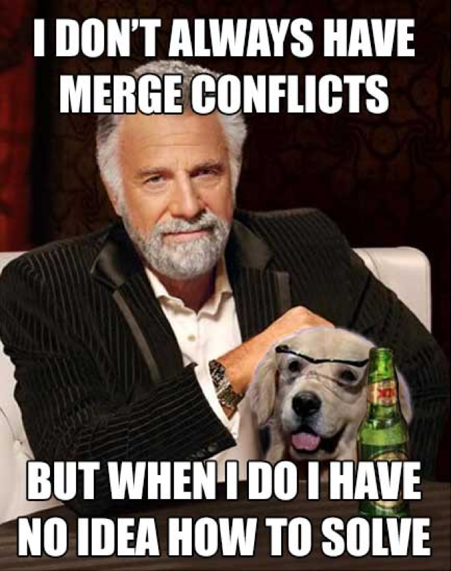

---

## How do we get conflicts?

- Dev **A** works on specific code
- Dev **B** works on the same code section
- Dev **A** push his state
- Dev **B** tries to push it
  - **MERGE CONFLICT**
  - Most of the time, GIT solves this for you

---

## How does such a conflict look like?

- GIT will let you know

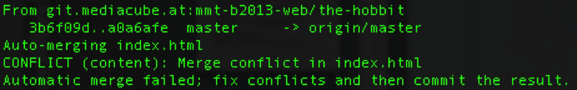

---

## How to resolve conflicts?

- Open affected file(s) and find the marked sections

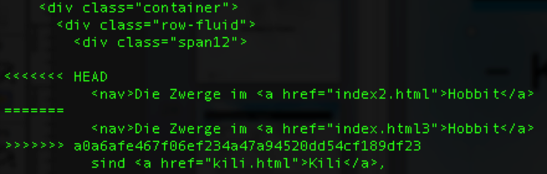

---

## I have resolved it, what should I do next?

- Add and commit your fix:
 - *git-add*
 - *git-commit*
 - *git-push*

- Be careful
 - Merge the right version
 - Do not checkin conflicts

---

## Result

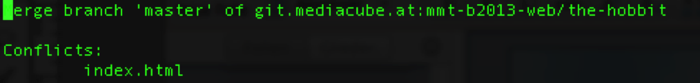

---

## Assignment

- New pairs
- Everyone gets a dwarf
  - Edit your dwarf
  - Push your changes
  - Solve conflicts

---

# Branching & Merging

---

## Scenario

- Many people working together
- Many people writing source code
- Many people using *git-pull* all the time
- Many people are frustrated about conflicts

---

# Solution?

---

# Create a branch!

---

# Branch

**Q:** What is a branch?
**A:** A pointer to a specifc commit

GIT is basically just a collection of commit objects
- Every commit objects references a predecessor commit object

Assignment Add:
[**Branches in a nutshell? GIT book**](https://git-scm.com/book/en/v2/Git-Branching-Branches-in-a-Nutshell)

---

# Branch

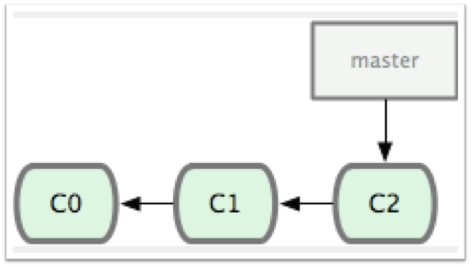

---

# Branch

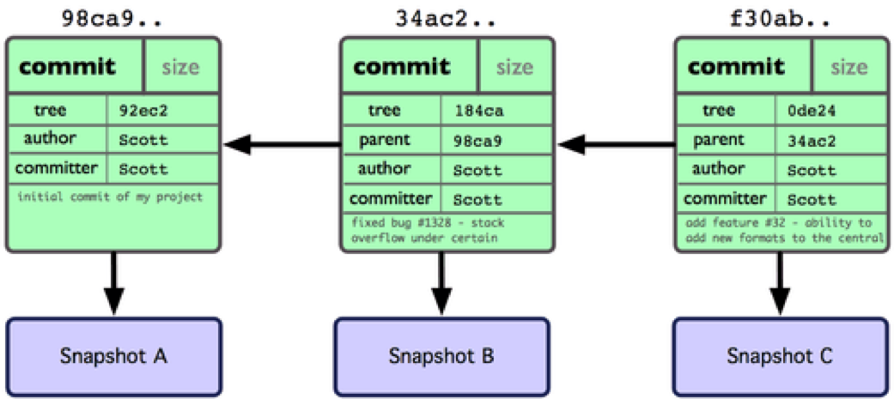

---

# New branch

```bash
git branch testing
```

---

# Branch

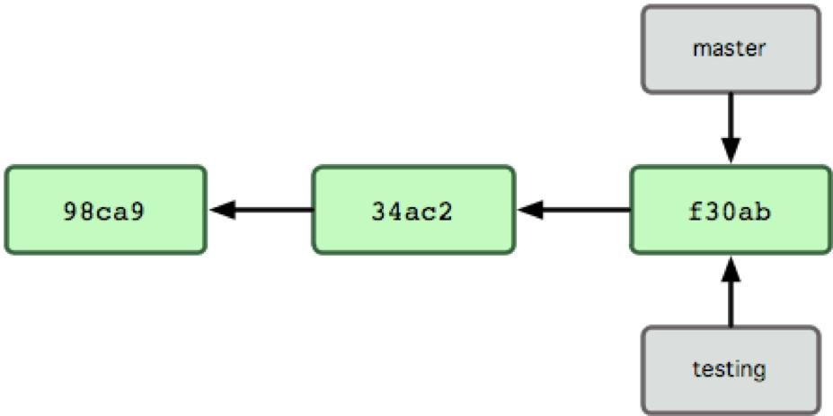

---

# List all branches

```bash
git branch
```

---

# I really want to see all branches!

```bash
git branch -a
```

---

# Branch

How does GIT know which branch is the current one?

- Special pointer named `HEAD`
- **ATTENTION:** You are not within the branch `HEAD`

---

# Branch

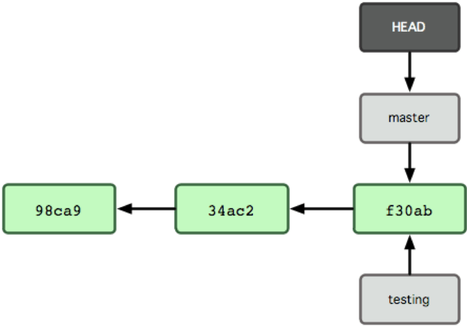

---

# Switch to another branch

```bash
git checkout testing
```

---

# Branch

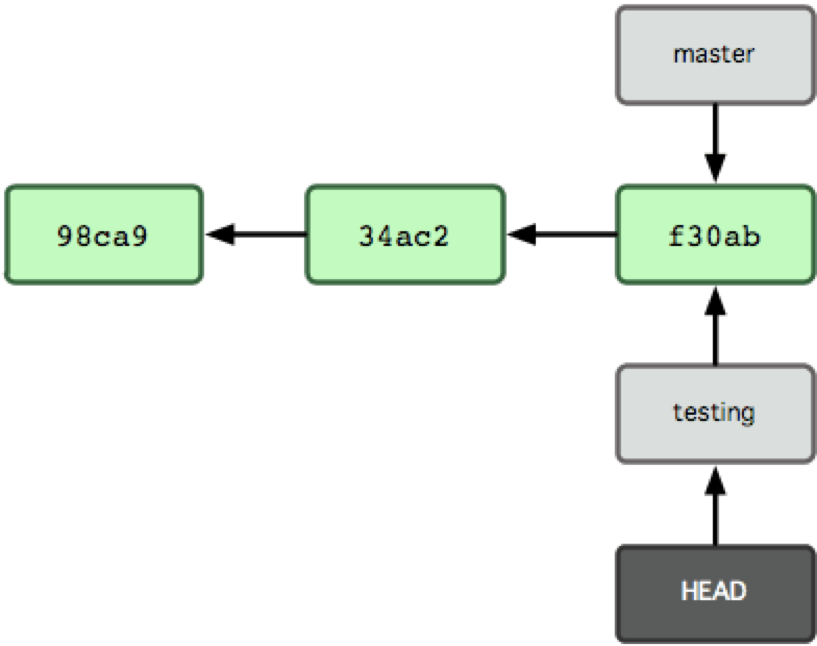

---

# Shortcut: Create a new branch and switch to newly created branch

```bash
git checkout -b testing
```

---

# Why do I need branches?

- Branch == Verzweigung
- Developer *A* is writing tests
- Developer *B* is working on new features

They are able to work on the same project without creating
conflicts all the time (e.g. every dwarf might get its own branch)

---

# Branch

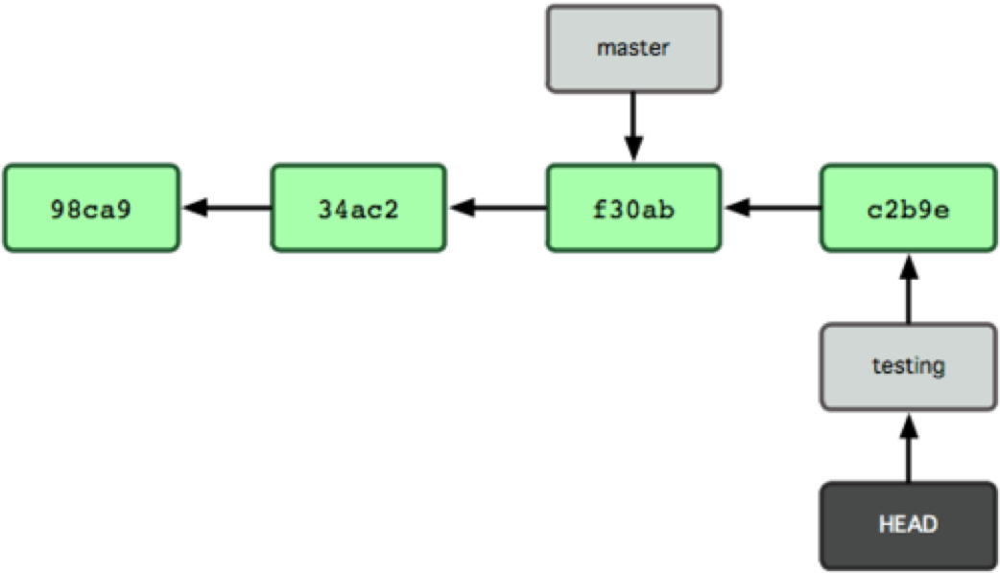

---

# Case Study

**BAD PRACTICE:**

- You work on a web application
- *Release 1.0*
- New features are developed for next release
- A bug has been identified for *Release 1.0*
- Hotfix is requested
- Features for *Release 1.1* are not ready for production
- **FAIL!**

---

**BEST PRACTICE:**

- You work on a web application
- *Release 1.0*
- New branch created *awesome-feature-branch*
- New feature is developed in *awesome-feature-branch*
- *Release 1.0* has a bug
- Hotfix for *Master* is now possible without producing sideeffects

---

# Branch

**ATTENTION:**

To switch branches, you have to ensure your current changes
are not conflicting with anything inside the branch you
are switching too.

```bash
git commit
```

Assignment Add:
**git stash in GIT book**

---

# Merge
## Bringing branches together

---

# Merge

What is a merge?

- The single commits of different branches are *merged* together
- GIT knows the starting point (Remember: The commit object knows its predecessor)

Assignment Add:
**git rebase in GIT book**

---

# Branch

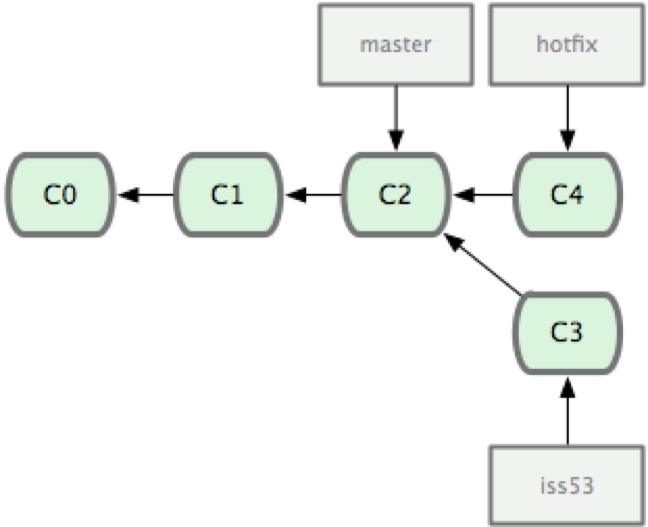

---

# Branch

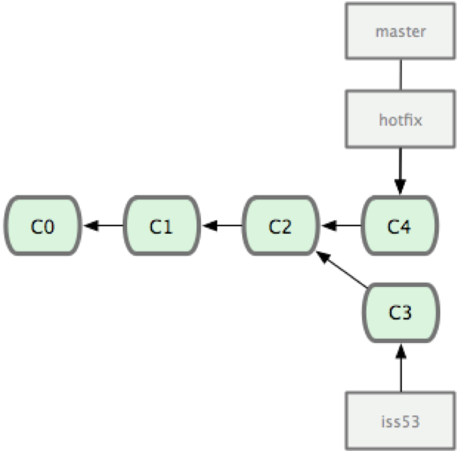

---

# But why is GIT better than other version control systems?

- You are working on *master*
- Your friend is fixing an issue in branch *issue-53*
- You have added plenty of commits since your friend started working on the issue
- GIT still can merge those two branches together

---

# Branch

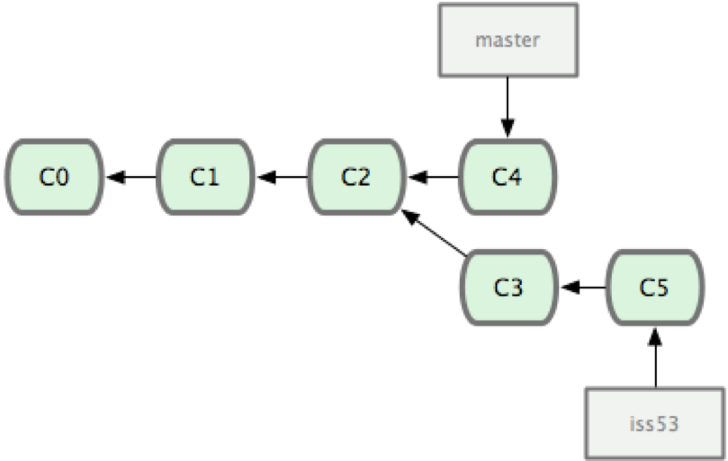

---

# But why is GIT better than other version control systems?

**Q:** How can GIT do that?
**A:** 3-Way Merge

---

# git-merge

- GIT compares 3 versions
  - The *issue-53* version
  - The *master* version
  - The base of those 2 versions
- GIT selects the best *base*
- GIT creates a *Merge Commit Object*
- This object has 2 predecessors!

GIT has created a new commit object with 2 predecessors.

---

# Branch

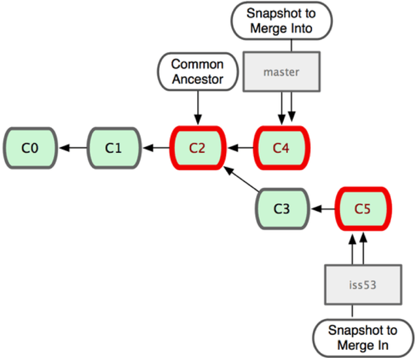

---

# Case Study

Example: Merge *testing* in *master*

```bash
git merge testing
```

---

**ATTENTION:**

- Be careful which branch you are going to merge.
- If you want to merge *issue-53* into *master*, checkout *master* and run `git merge issue-53`

Every branch can merged into any other branch!

---

# Branch

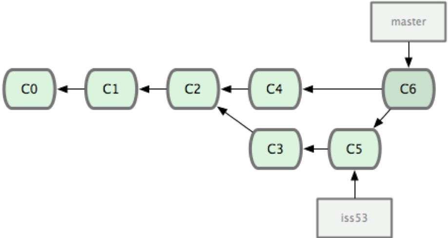

---

# Housekeeping

How do I keep my projects clean?

- Do I need all branches on the remote location too?
- Should I delete a branch after merging it back into *master*
- Establish a GIT workflow (e.g. feature branches)

---

# Housekeeping

Remove local branch:

```bash
git branch -d testing
```

---

# Housekeeping

Remove remote branch:

```bash
git push origin :testing
```

---

# Assignment

- Create a feature branch and be happy!
